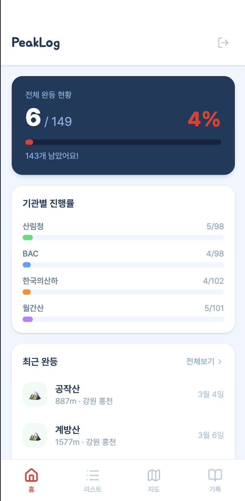
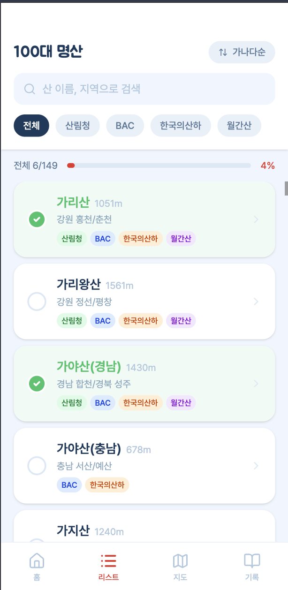
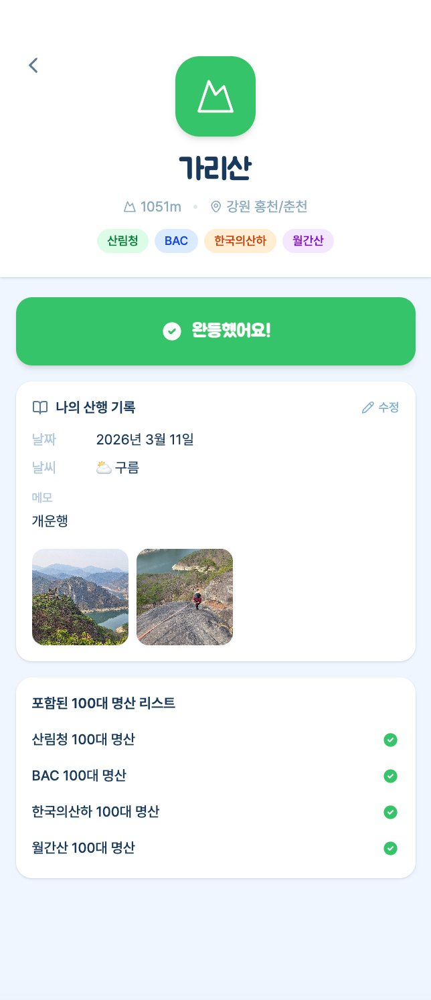
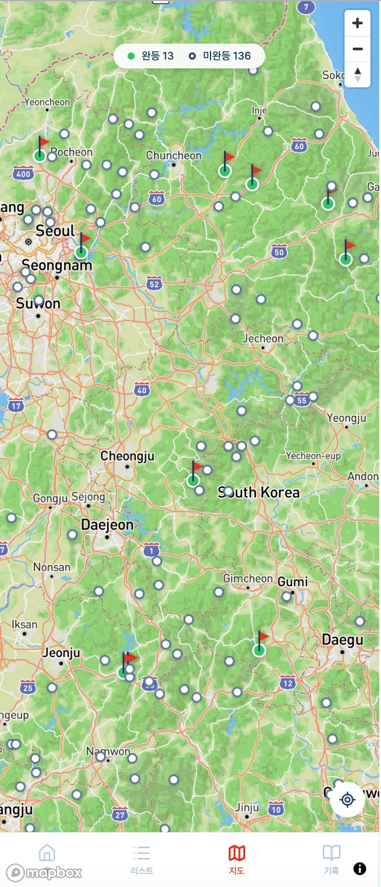

# 🏔️ PeakLog

한국 4대 등산 기관의 100대 명산을 기록하는 모바일 웹 서비스

**배포 주소** : https://peak-log-rosy.vercel.app

---

## 스크린샷

<table>
  <tr>
    <td align="center"><b>커버</b></td>
    <td align="center"><b>로그인</b></td>
    <td align="center"><b>홈 대시보드</b></td>
  </tr>
  <tr>
    <td></td>
    <td></td>
    <td></td>
  </tr>
  <tr>
    <td align="center"><b>100대 명산 리스트</b></td>
    <td align="center"><b>산 상세 / 기록</b></td>
    <td align="center"><b>산행 달력</b></td>
  </tr>
  <tr>
    <td></td>
    <td></td>
    <td></td>
  </tr>
  <tr>
    <td align="center"><b>지도</b></td>
    <td></td>
    <td></td>
  </tr>
  <tr>
    <td></td>
    <td></td>
    <td></td>
  </tr>
</table>

---

## 소개

산림청, 블랙야크(BAC), 한국의산하, 월간산 — 4개 기관이 선정한 100대 명산 목록을 한 곳에서 관리합니다.
총 149개 고유 산에 대해 완등 여부를 기록하고, 산행 날짜·날씨·동행인·메모·사진을 남길 수 있습니다.

---

## 주요 기능

| 기능 | 설명 |
|------|------|
| 완등 체크 | 산 완등 시 날짜 직접 입력 가능 |
| 리스트 | 기관별 필터, 검색, 가나다순/미완등 먼저 정렬 |
| 대시보드 | 전체 및 기관별 진행률, 최근 완등 목록 |
| 산행 기록 | 날짜·날씨·동행인·메모·사진(최대 3장) 기록 |
| 달력 | 월별 산행 기록 캘린더 뷰, 날짜 클릭 시 해당 기록 필터링 |
| 지도 | Mapbox 기반 149개 산 위치 마커 (완등 깃발/미완등 점), GPS 내 위치 이동 |
| 사진 뷰어 | 사진 클릭 시 전체 화면 확대, 좌우 넘기기 지원 |

---

## 기술 스택

- **Frontend** : React 19 + TypeScript + Vite
- **Styling** : Tailwind CSS v4
- **State** : Zustand
- **Backend** : Supabase (Auth + PostgreSQL + Storage)
- **Map** : Mapbox GL JS v3
- **Deploy** : Vercel

---

## 데이터

| 기관 | 산 수 |
|------|------|
| 산림청 | 100개 |
| 블랙야크 (BAC) | 100개 |
| 한국의산하 | 100개 |
| 월간산 | 100개 |
| **고유 산 합계** | **149개** |

---

## 로컬 실행

```bash
# 패키지 설치
npm install

# 환경변수 설정 (.env 파일 생성)
VITE_SUPABASE_URL=your_supabase_url
VITE_SUPABASE_ANON_KEY=your_supabase_anon_key
VITE_MAPBOX_TOKEN=your_mapbox_public_token

# 개발 서버 실행
npm run dev
```

---

## Supabase 스키마

```sql
mountains (id, name_ko, height, region, lat, lng, organizations[])
completions (id, user_id, mountain_id, completed_at, hiked_date)
records (id, user_id, mountain_id, hiked_date, companions, weather, memo, photo_urls[])
```

---

*개인 프로젝트 — 2인 사용 기준으로 제작*
